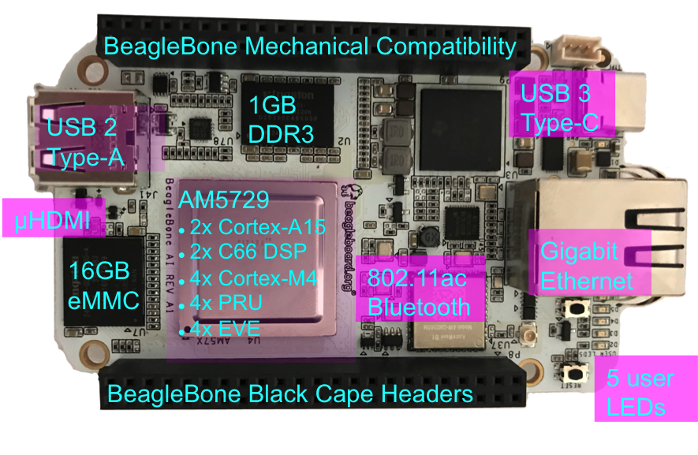

(BB AI Image)

# THIS DOCUMENT

This work is licensed under a [Creative Commons Attribution-ShareAlike 4.0 International License](http://creativecommons.org/licenses/by-sa/4.0/)

All derivative works are to be attributed to [Jason Kridner of BeagleBoard.org](https://beagleboard.org/about/jkridner).

Supply comments and errors via [https://github.com/beagleboard/beaglebone-ai/issues](https://github.com/beagleboard/beaglebone-ai/issues).

All information in this document is subject to change without notice.

For an up to date version of this document refer to:

[https://github.com/beagleboard/beaglebone-ai/wiki/System-Reference-Manual](https://github.com/beagleboard/beaglebone-ai/wiki/System-Reference-Manual)

# BeagleBone AI Design

## REGULATORY AND COMPLIANCE INFORMATION

## WARNINGS, RESTRICTIONS, AND DISCLAIMERS

## WARRANTY

# Table of Contents (insert here)

# 1.0 Introduction

Built on the proven BeagleBoard.org® open source Linux approach, BeagleBone® AI fills the gap between small SBCs and more powerful industrial computers. Based on the Texas Instruments AM5729, developers have access to the powerful SoC with the ease of BeagleBone® Black header and mechanical compatibility. BeagleBone® AI makes it easy to explore how artificial intelligence (AI) can be used in everyday life via TI C66x digital-signal-processor (DSP) cores and embedded-vision-engine (EVE) cores supported through an optimized TIDL machine learning OpenCL API with pre-installed tools. Focused on everyday automation in industrial, commercial and home applications.

# 2.0 Change History

\Begin{multicols}{2}

### 2.1 Document Change History

### 2.2 Board changes

#### 2.2.1 Rev A0
Initial prototype revision. Not taken to production.

#### 2.2.2 Rev A1

Second round prototype.

* Fixed size of mounting holes.
* Added LED for WiFi status.
* Added microHDMI.
* Changed eMMC voltage from 3.3V to 1.8V to support HS200.
* Changed eMMC from 4GB to 16GB.
* Changed serial debug header from 6-pin 100mil pitch to 3-pin 1.5mm pitch.
* Switched expansion header from UART4 to UART5. The UART4 pins were used for the microHDMI.

#### 2.2.3 Rev A1a

Pilot run.

* Added pull-down resistor on serial debug header RX line.

#### 2.2.4 Rev A2

Proposed changes.

* Moved microSD card cage closer to microHDMI to fit cases better.
* Connected AM5729 ball AB10 to to P9.13 to provide a GPIO.
* HDMI hot-plug detection fixes planned (TBD). 

# 3.0 Connecting Up Your BeagleBone AI

### 3.1 What's In the Box
BeagleBone® AI Comes in the Box with 4 items

* BeagleBone® AI Single Board Computer
* 3 Pin Debug Cable
* Antenna
* Heat Sink

### 3.2 Main Connection Scenarios

### 3.3 Tethered to a PC

### 3.4 Standalone w/Display and Keyboard/Mouse

# 4.0 BeagleBone AI Overview

### 4.1 BeagleBone Compatibility (Do we want this?)

### 4.2 BeagleBone AI Features

**Main Processor Features**

* Dual 1.5GHz ARM® Cortex®-A15 with out-of-order speculative issue 3-way superscalar execution pipeline for the fastest execution of existing 32-bit code
* 2 466x Floating-Point VLIW DSP supported by OpenCL
* 4 Embedded Vision Engines (EVEs) supported by TIDL machine learning library
* 2x Dual-Core Programmable Real-Time Unit (PRU) subsystems (4 PRUs total) for ultra low-latency control and software generated peripherals
* 2x Dual ARM® Cortex®-M4 co-processors for real-time control
* IVA-HD subsystem with support for 4K @ 15fps H.264 encode/decode and other codecs @ 1080p60
* Vivante® GC320 2D graphics accelerator
* Dual-Core PowerVR® SGX544™ 3D GPU

**Communications**

* BeagleBone Black header and mechanical compatibility
* 16-bit LCD interfaces
* 4+ UARTs
* 2 I2C ports
* 2 SPI ports
* Lots of PRU I/O pins

**Memory**

* 1GB RAM
* 16GB on-board eMMC flash

**Connectors**

* USB Type-C connector for power and SuperSpeed dual-role controller
* Gigabit Ethernet
* 802.11ac 2.4/5GHz WiFi

**Out of Box Software**

* Zero-download out of box software environment

### 4.3 Board Component Locations

# 5.0 BeagleBone AI High Level Specification

### Block Diagram
### Processor
### DSP
### EVEs
### PRUs
### Graphics Accelerator
### Memory
### Power
### Connectivity

# 6.0 Detailed Hardware Design

This section provides a detailed description of the Hardware design. This can be useful for interfacing, writing drivers, or using it to help modify specifics of your own design.

**Figure ?** below is the high level block diagram of the board.

(Block Diagram Picture)

**Figure ?. BeagleBone AI Block Diagram**

### 6.1 Power Section

**Figure ?** is the high level block diagram of the power section of the board.

(Block Diagram for Power)

#### 6.1.1 TPS6590377 PMIC

(Info from Datasheet)

(Block Diagram from Datasheet)

#### 6.1.2 USB-C Power

**Figure 23** below shows how the USB-C power input is connected to the **TPS6590377**.

(Schematic screenshoot)

#### 6.1.3 Power Button

#### 6.1.4  

# 7.0 Connectors

### 7.1 Expansion Connectors

The expansion interface on the board is comprised of two 46 pin connectors, the P8 and P9 Headers. All signals on the expansion headers are **3.3V** unless otherwise indicated.

**NOTE**: Do not connect 5V logic level signals to these pins or the board will be damaged.

**NOTE**: DO NOT APPLY VOLTAGE TO ANY I/O PIN WHEN POWER IS NOT SUPPLIED TO THE BOARD. IT WILL DAMAGE THE PROCESSOR AND VOID THE WARRANTY.

**NO PINS ARE TO BE DRIVEN UNTIL AFTER THE SYS_RESET LINE GOES HIGH.**

**Figure ?** shows the location of the expansion connectors.

The location and spacing of the expansion headers are the same as on the BeagleBone Black.

#### 7.1.1 Connector P8

**Table ?** shows the pinout of the **P8** expansion header. Other signals can be connected to this connector based on setting the pin mux on the processor, but this is the default settings on power up. The SW is responsible for setting the default function of each pin. There are some signals that have not been listed here. Refer to the processor documentation for more information on these pins and detailed descriptions of all of the pins listed. In some cases there may not be enough signals to complete a group of signals that may be required to implement a total interface.

The **PROC** column is the pin number on the processor.

The **PIN** column is the pin number on the expansion header.

The **MODE** columns are the mode setting for each pin. Setting each mode to align with the mode column will give that function on that pin.

**NOTE**: DO NOT APPLY VOLTAGE TO ANY I/O PIN WHEN POWER IS NOT SUPPLIED TO THE BOARD. IT WILL DAMAGE THE PROCESSOR AND VOID THE WARRANTY.

**NO PINS ARE TO BE DRIVEN UNTIL AFTER THE SYS_RESET LINE GOES HIGH.**

\End{multicols}

**Table ?** Expansion Header P8 Pinout

| PIN | PROC | NAME           | MODE0        | MODE1        | MODE2        | MODE3         | MODE4         |
| --- | ---- | -------------- | ------------ | ------------ | ------------ | ------------- | ------------- |
|1    |      | GND            |              |              |              |               |               |
|2    |      | GND            |              |              |              |               |               |
|3    | AB8  | AB8_MMC3_DATA6 | mmc3_dat6    | spi4_d0      | uart10_ctsn  |               | vin2b_de1     |
|4    | AB5  | AB5_MMC3_DATA7 | mmc3_dat7    | spi4_cs0     | uart10_rtsn  |               | vin2b_clk1    |
|5    | AC9  | AC9_MMC3_DATA2 | mmc3_dat2    | spi3_cs0     | uart5_ctsn   |               | vin2b_d3      |
|6    | AC3  | AC3_MMC3_DATA3 | mmc3_dat3    | spi3_cs1     | uart5_rtsn   |               | vin2b_d2      |
|7    | G14  | G14_TIMER11    | mcasp1_axr14 | mcasp7_aclkx | mcasp7_aclkr |               |               |
|8    | F14  | F14_TIMER12    | mcasp1_axr15 | mcasp7_fsx   | mcasp7_fsr   |               |               |
|9    | E17  | E17_TIMER14    | xref_clk1    | mcasp2_axr9  | mcasp1_axr5  | mcasp2_ahclkx | mcasp6_ahclkx |
|10   | A13  | A13_TIMER10    | mcasp1_axr13 | mcasp7_axr1  |              |               |               |
|11   | AH4  | AH4_GPIO3_11   | vin1a_d7     |              |              | vout3_d0      | vout3_d16     |
|12   | AG6  | AG6_GPIO3_10   | vin1a_d6     |              |              | vout3_d1      | vout3_d17     |
|13   | D3   | D3_EHRPWM2B    | vin2a_d10    |              |              | mdio_mclk     | vout2_d13     |
|14   | D5   | D5_GPIO4_13    | vin2a_d12    |              |              | rgmii1_txc    | vout2_d11     |
|15   | D1   | GPIO4_3        | vin2a_d2     |              |              |               | vout2_d21     |
|     | A3   |                | vin2a_d19    |              | vin2b_d4     | rgmii1_rxctl  | vout2_d4      |
|16   | B4   | B4_GPIO4_29    | vin2a_d21    |              | vin2b_d2     | rgmii1_rxd2   | vout2_d2      |
|17   | A7   | A7_GPIO8_18    | vout1_d18    |              | emu4         | vin4a_d2      | vin3a_d2      |
|18   | F5   | F5_GPIO4_9     | vin2a_d8     |              |              |               | vout2_d15     |
|19   | E6   | E6_EHRPWM2A    | vin2a_d9     |              |              |               | vout2_d14     |
|20   | AC4  | AC4_MMC3_CMD   | mmc3_cmd     | spi3_sclk    |              |               | vin2b_d6      |
|21   | AD4  | AD4_MMC3_CLK   | mmc3_clk     |              |              |               | vin2b_d7      |
|22   | AD6  | AD6_MMC3_DATA5 | mmc3_dat5    | spi4_d1      | uart10_txd   |               | vin2b_d0      |
|23   | AC8  | AC8_MMC3_DATA4 | mmc3_dat4    | spi4_sclk    | uart10_rxd   |               | vin2b_d1      |
|24   | AC6  | AC6_MMC3_DATA1 | mmc3_dat1    | spi3_d0      | uart5_txd    |               | vin2b_d4      |
|25   | AC7  | AC7_MMC3_DATA0 | mmc3_dat0    | spi3_d1      | uart5_rxd    |               | vin2b_d5      |
|26   | B3   | B3_GPIO4_28    | vin2a_d20    |              | vin2b_d3     | rgmii1_rxd3   | vout2_d3      |
|27   | E11  | LCD_VSYNC      | vout1_vsync  |              |              | vin4a_vsync0  | vin3a_vsync0  |
|     | A8   |                | vout1_d19    |              | emu15        | vin4a_d3      | vin3a_d3      |
|28   | D11  | LCD_CLK        | vout1_clk    |              |              | vin4a_fld0    | vin3a_fld0    |
|     | C9   |                | vout1_d20    |              | emu16        | vin4a_d4      | vin3a_d4      |
|29   | C11  | LCD_HSYNC      | vout1_hsync  |              |              | vin4a_hsync0  | vin3a_hsync0  |
|     | A9   |                | vout1_d21    |              | emu17        | vin4a_d5      | vin3a_d5      |
|30   | B10  | LCD_DE         | vout1_de     |              |              | vin4a_de0     | vin3a_de0     |
|     | B9   |                | vout1_d22    |              | emu18        | vin4a_d6      | vin3a_d6      |
|31   | C8   | LCD_DATA14     | vout1_d14    |              | emu13        | vin4a_d14     | vin3a_d14     |
|     | G16  |                | mcasp4_axr0  |              | spi3_d0      | uart8_ctsn    | uart4_rxd     |
|32   | C7   | LCD_DATA15     | vout1_d15    |              | emu14        | vin4a_d15     | vin3a_d15     |
|     | D17  |                | mcasp4_axr1  |              | spi3_cs0     | uart8_rtsn    | uart4_txd     |
|33   | C6   | LCD_DATA13     | vout1_d13    |              | emu12        | vin4a_d13     | vin3a_d13     |
|     | AF9  |                | vin1a_fld0   | vin1b_vsync1 |              |               | vout3_clk     |
|34   | D8   | LCD_DATA11     | vout1_d11    |              | emu10        | vin4a_d11     | vin3a_d11     |
|     | G6   |                | vin2a_vsync0 |              |              | vin2b_vsync1  | vout2_vsync   |
|35   | A5   | LCD_DATA12     | vout1_d12    |              | emu11        | vin4a_d12     | vin3a_d12     |
|     | AD9  |                | vin1a_de0    | vin1b_hsync1 |              | vout3_d17     | vout3_de      |
|36   | D7   | LCD_DATA10     | vout1_d10    |              | emu3         | vin4a_d10     | vin3a_d10     |
|     | F2   |                | vin2a_d0     |              |              |               | vout2_d23     |
|37   | E8   | LCD_DATA8      | vout1_d8     |              | uart6_rxd    | vin4a_d8      | vin3a_d8      |
|     | A21  |                | mcasp4_fsx   | mcasp4_fsr   | spi3_d1      | uart8_txd     | i2c4_scl      |
|38   | D9   | LCD_DATA9      | vout1_d9     |              | uart6_txd    | vin4a_d9      | vin3a_d9      |
|     | C18  |                | mcasp4_aclkx | mcasp4_aclkr | spi3_sclk    | uart8_rxd     | i2c4_sda      |
|39   | F8   | F8_LCD_DATA6   | vout1_d6     |              | emu8         | vin4a_d22     | vin3a_d22     |
|40   | E7   | E7_LCD_DATA7   | vout1_d7     |              | emu9         | vin4a_d23     | vin3a_d23     |
|41   | E9   | E9_LCD_DATA4   | vout1_d4     |              | emu6         | vin4a_d20     | vin3a_d20     |
|42   | F9   | F9_LCD_DATA5   | vout1_d5     |              | emu7         | vin4a_d21     | vin3a_d21     |
|43   | F10  | F10_LCD_DATA2  | vout1_d2     |              | emu2         | vin4a_d18     | vin3a_d18     |
|44   | G11  | G11_LCD_DATA3  | vout1_d3     |              | emu5         | vin4a_d19     | vin3a_d19     |
|45   | F11  | LCD_DATA0      | vout1_d0     |              | uart5_rxd    | vin4a_d16     | vin3a_d16     |
|     | B7   |                | vout1_d16    |              | uart7_rxd    | vin4a_d0      | vin3a_d0      |
|46   | G10  | LCD_DATA1      | vout1_d1     |              | uart5_txd    | vin4a_d17     | vin3a_d17     |
|     | A10  |                | vout1_d23    |              | emu19        | vin4a_d7      | vin3a_d7      |

| PIN | PROC | MODE5      | MODE6     | MODE7      | MODE8        | MODE9        | MODE10                      |
| --- | ---- | ---------- | --------- | ---------- | ------------ | ------------ | --------------------------- |
|1    |      |            |           |            |              |              |                             |
|2    |      |            |           |            |              |              |                             |
|3    | AB8  |            |           |            |              | vin5a_hsync0 | ehrpwm3_tripzone_input      |
|4    | AB5  |            |           |            |              | vin5a_vsync0 | eCAP3_in_PWM3_out           |
|5    | AC9  |            |           |            |              | vin5a_d3     | eQEP3_index                 |
|6    | AC3  |            |           |            |              | vin5a_d2     | eQEP3_strobe                |
|7    | G14  |            |           | vin6a_d9   |              |              | timer11                     |
|8    | F14  |            |           | vin6a_d8   |              |              | timer12                     |
|9    | E17  |            |           | vin6a_clk0 |              |              | timer14                     |
|10   | A13  |            |           | vin6a_d10  |              |              | timer10                     |
|11   | AH4  |            |           |            |              |              | eQEP2B_in                   |
|12   | AG6  |            |           |            |              |              | eQEP2A_in                   |
|13   | D3   |            |           |            |              | kbd_col7     | ehrpwm2B                    |
|14   | D5   |            |           |            | mii1_rxclk   | kbd_col8     | eCAP2_in_PWM2_out           |
|15   | D1   | emu12      |           |            | uart10_rxd   | kbd_row6     | eCAP1_in_PWM1_out           |
|     | A3   |            | vin3a_d11 |            | mii1_txer    |              | ehrpwm3_tripzone_input      |
|16   | B4   | vin3a_fld0 | vin3a_d13 |            | mii1_col     |              |                             |
|17   | A7   | obs11      | obs27     |            |              |              | pr2_edio_data_in2           |
|18   | F5   | emu18      |           |            | mii1_rxd3    | kbd_col5     | eQEP2_strobe                |
|19   | E6   | emu19      |           |            | mii1_rxd0    | kbd_col6     | ehrpwm2A                    |
|20   | AC4  |            |           |            |              | vin5a_d6     | eCAP2_in_PWM2_out           |
|21   | AD4  |            |           |            |              | vin5a_d7     | ehrpwm2_tripzone_input      |
|22   | AD6  |            |           |            |              | vin5a_d0     | ehrpwm3B                    |
|23   | AC8  |            |           |            |              | vin5a_d1     | ehrpwm3A                    |
|24   | AC6  |            |           |            |              | vin5a_d4     | eQEP3B_in                   |
|25   | AC7  |            |           |            |              | vin5a_d5     | eQEP3A_in                   |
|26   | B3   | vin3a_de0  | vin3a_d12 |            | mii1_rxer    |              | eCAP3_in_PWM3_out           |
|27   | E11  |            |           |            | spi3_sclk    |              |                             |
|     | A8   | obs12      | obs28     |            |              |              | pr2_edio_data_in3           |
|28   | D11  |            |           |            | spi3_cs0     |              |                             |
|     | C9   | obs13      | obs29     |            |              |              | pr2_edio_data_in4           |
|29   | C11  |            |           |            | spi3_d0      |              |                             |
|     | A9   | obs14      | obs30     |            |              |              | pr2_edio_data_in5           |
|30   | B10  |            |           |            | spi3_d1      |              |                             |
|     | B9   | obs15      | obs31     |            |              |              | pr2_edio_data_in6           |
|31   | C8   | obs9       | obs25     |            |              |              | pr2_uart0_txd               |
|     | G16  |            | vout2_d18 |            | vin4a_d18    | vin5a_d13    |                             |
|32   | C7   | obs10      | obs26     |            |              |              | pr2_ecap0_ecap_capin_apwm_o |
|     | D17  |            | vout2_d19 |            | vin4a_d19    | vin5a_d12    |                             |
|33   | C6   | obs8       | obs24     |            |              |              | pr2_uart0_rxd               |
|     | AF9  | uart7_txd  |           | timer15    | spi3_d1      | kbd_row1     | eQEP1B_in                   |
|34   | D8   | obs6       | obs22     | obs_dmarq2 |              |              | pr2_uart0_cts_n             |
|     | G6   | emu9       |           | uart9_txd  | spi4_d1      | kbd_row3     | ehrpwm1A                    |
|35   | A5   | obs7       | obs23     |            |              |              | pr2_uart0_rts_n             |
|     | AD9  | uart7_rxd  |           | timer16    | spi3_sclk    | kbd_row0     | eQEP1A_in                   |
|36   | D7   | obs5       | obs21     | obs_irq2   |              |              | pr2_edio_sof                |
|     | F2   | emu10      |           | uart9_ctsn | spi4_d0      | kbd_row4     | ehrpwm1B                    |
|37   | E8   |            |           |            |              |              | pr2_edc_sync1_out           |
|     | A21  |            | vout2_d17 |            | vin4a_d17    | vin5a_d14    |                             |
|38   | D9   |            |           |            |              |              | pr2_edio_latch_in           |
|     | C18  |            | vout2_d16 |            | vin4a_d16    | vin5a_d15    |                             |
|39   | F8   | obs4       | obs20     |            |              |              | pr2_edc_latch1_in           |
|40   | E7   |            |           |            |              |              | pr2_edc_sync0_out           |
|41   | E9   | obs2       | obs18     |            |              |              | pr1_ecap0_ecap_capin_apwm_o |
|42   | F9   | obs3       | obs19     |            |              |              | pr2_edc_latch0_in           |
|43   | F10  | obs0       | obs16     | obs_irq1   |              |              | pr1_uart0_rxd               |
|44   | G11  | obs1       | obs17     | obs_dmarq1 |              |              | pr1_uart0_txd               |
|45   | F11  |            |           |            | spi3_cs2     |              | pr1_uart0_cts_n             |
|     | B7   |            |           |            |              |              | pr2_edio_data_in0           |
|46   | G10  |            |           |            |              |              | pr1_uart0_rts_n             |
|     | A10  |            |           |            | spi3_cs3     |              | pr2_edio_data_in7           |

| PIN | PROC | MODE11                      | MODE12            | MODE13             | MODE14   |
| --- | ---- | --------------------------- | ----------------- | ------------------ | -------- |
|1    |      |                             |                   |                    |          |
|2    |      |                             |                   |                    |          |
|3    | AB8  | pr2_mii1_rxd1               | pr2_pru0_gpi10    | pr2_pru0_gpo10     | gpio1_24 |
|4    | AB5  | pr2_mii1_rxd0               | pr2_pru0_gpi11    | pr2_pru0_gpo11     | gpio1_25 |
|5    | AC9  | pr2_mii_mr1_clk             | pr2_pru0_gpi6     | pr2_pru0_gpo6      | gpio7_1  |
|6    | AC3  | pr2_mii1_rxdv               | pr2_pru0_gpi7     | pr2_pru0_gpo7      | gpio7_2  |
|7    | G14  | pr2_mii0_rxdv               | pr2_pru1_gpi16    | pr2_pru1_gpo16     | gpio6_5  |
|8    | F14  | pr2_mii0_rxd3               | pr2_pru0_gpi20    | pr2_pru0_gpo20     | gpio6_6  |
|9    | E17  | pr2_mii1_crs                | pr2_pru1_gpi6     | pr2_pru1_gpo6      | gpio6_18 |
|10   | A13  | pr2_mii_mr0_clk             | pr2_pru1_gpi15    | pr2_pru1_gpo15     | gpio6_4  |
|11   | AH4  |                             | pr1_pru0_gpi4     | pr1_pru0_gpo4      | gpio3_11 |
|12   | AG6  |                             | pr1_pru0_gpi3     | pr1_pru0_gpo3      | gpio3_10 |
|13   | D3   | pr1_mdio_mdclk              | pr1_pru1_gpi7     | pr1_pru1_gpo7      | gpio4_11 |
|14   | D5   | pr1_mii1_txd1               | pr1_pru1_gpi9     | pr1_pru1_gpo9      | gpio4_13 |
|15   | D1   | pr1_ecap0_ecap_capin_apwm_o | pr1_edio_data_in7 | pr1_edio_data_out7 | gpio4_3  |
|     | A3   | pr1_mii1_rxd0               | pr1_pru1_gpi16    | pr1_pru1_gpo16     | gpio4_27 |
|16   | B4   | pr1_mii1_rxlink             | pr1_pru1_gpi18    | pr1_pru1_gpo18     | gpio4_29 |
|17   | A7   | pr2_edio_data_out2          | pr2_pru0_gpi15    | pr2_pru0_gpo15     | gpio8_18 |
|18   | F5   | pr1_mii1_txd3               | pr1_pru1_gpi5     | pr1_pru1_gpo5      | gpio4_9  |
|19   | E6   | pr1_mii1_txd2               | pr1_pru1_gpi6     | pr1_pru1_gpo6      | gpio4_10 |
|20   | AC4  | pr2_mii1_txd2               | pr2_pru0_gpi3     | pr2_pru0_gpo3      | gpio6_30 |
|21   | AD4  | pr2_mii1_txd3               | pr2_pru0_gpi2     | pr2_pru0_gpo2      | gpio6_29 |
|22   | AD6  | pr2_mii1_rxd2               | pr2_pru0_gpi9     | pr2_pru0_gpo9      | gpio1_23 |
|23   | AC8  | pr2_mii1_rxd3               | pr2_pru0_gpi8     | pr2_pru0_gpo8      | gpio1_22 |
|24   | AC6  | pr2_mii1_txd0               | pr2_pru0_gpi5     | pr2_pru0_gpo5      | gpio7_0  |
|25   | AC7  | pr2_mii1_txd1               | pr2_pru0_gpi4     | pr2_pru0_gpo4      | gpio6_31 |
|26   | B3   | pr1_mii1_rxer               | pr1_pru1_gpi17    | pr1_pru1_gpo17     | gpio4_28 |
|27   | E11  |                             | pr2_pru1_gpi17    | pr2_pru1_gpo17     | gpio4_23 |
|     | A8   | pr2_edio_data_out3          | pr2_pru0_gpi16    | pr2_pru0_gpo16     | gpio8_19 |
|28   | D11  |                             |                   |                    | gpio4_19 |
|     | C9   | pr2_edio_data_out4          | pr2_pru0_gpi17    | pr2_pru0_gpo17     | gpio8_20 |
|29   | C11  |                             |                   |                    | gpio4_22 |
|     | A9   | pr2_edio_data_out5          | pr2_pru0_gpi18    | pr2_pru0_gpo18     | gpio8_21 |
|30   | B10  |                             |                   |                    | gpio4_20 |
|     | B9   | pr2_edio_data_out6          | pr2_pru0_gpi19    | pr2_pru0_gpo19     | gpio8_22 |
|31   | C8   |                             | pr2_pru0_gpi11    | pr2_pru0_gpo11     | gpio8_14 |
|     | G16  |                             |                   |                    |          |
|32   | C7   |                             | pr2_pru0_gpi12    | pr2_pru0_gpo12     | gpio8_15 |
|     | D17  |                             | pr2_pru1_gpi0     | pr2_pru1_gpo0      |          |
|33   | C6   |                             | pr2_pru0_gpi10    | pr2_pru0_gpo10     | gpio8_13 |
|     | AF9  |                             |                   |                    | gpio3_1  |
|34   | D8   |                             | pr2_pru0_gpi8     | pr2_pru0_gpo8      | gpio8_11 |
|     | G6   | pr1_uart0_rts_n             | pr1_edio_data_in4 | pr1_edio_data_out4 | gpio4_0  |
|35   | A5   |                             | pr2_pru0_gpi9     | pr2_pru0_gpo9      | gpio8_12 |
|     | AD9  |                             |                   |                    | gpio3_0  |
|36   | D7   |                             | pr2_pru0_gpi7     | pr2_pru0_gpo7      | gpio8_10 |
|     | F2   | pr1_uart0_rxd               | pr1_edio_data_in5 | pr1_edio_data_out5 | gpio4_1  |
|37   | E8   |                             | pr2_pru0_gpi5     | pr2_pru0_gpo5      | gpio8_8  |
|     | A21  |                             |                   |                    |          |
|38   | D9   |                             | pr2_pru0_gpi6     | pr2_pru0_gpo6      | gpio8_9  |
|     | C18  |                             |                   |                    |          |
|39   | F8   |                             | pr2_pru0_gpi3     | pr2_pru0_gpo3      | gpio8_6  |
|40   | E7   |                             | pr2_pru0_gpi4     | pr2_pru0_gpo4      | gpio8_7  |
|41   | E9   |                             | pr2_pru0_gpi1     | pr2_pru0_gpo1      | gpio8_4  |
|42   | F9   |                             | pr2_pru0_gpi2     | pr2_pru0_gpo2      | gpio8_5  |
|43   | F10  |                             | pr2_pru1_gpi20    | pr2_pru1_gpo20     | gpio8_2  |
|44   | G11  |                             | pr2_pru0_gpi0     | pr2_pru0_gpo0      | gpio8_3  |
|45   | F11  |                             | pr2_pru1_gpi18    | pr2_pru1_gpo18     | gpio8_0  |
|     | B7   | pr2_edio_data_out0          | pr2_pru0_gpi13    | pr2_pru0_gpo13     | gpio8_16 |
|46   | G10  |                             | pr2_pru1_gpi19    | pr2_pru1_gpo19     | gpio8_1  |
|     | A10  | pr2_edio_data_out7          | pr2_pru0_gpi20    | pr2_pru0_gpo20     | gpio8_23 |

Notes regarding the resistors on muxed pins.

#### 7.1.2 Connector P9

**Table ?** lists the signals on connector **P9**. Other signals can be connected to this connector based on setting the pin mux on the processor, but this is the default settings on power up.

There are some signals that have not been listed here. Refer to the processor documentation for more information on these pins and detailed descriptions of all of the pins listed. In some cases there may not be enough signals to complete a group of signals that may be required to implement a total interface.

The **PROC** column is the pin number on the processor.

The **PIN** column is the pin number on the expansion header.

The **MODE** columns are the mode setting for each pin. Setting each mode to align with the mode column will give that function on that pin.

NOTES:

In the table are the following notations:

**PWR_BUT** is a 5V level as pulled up internally by the TPS6590377. It is activated by pulling the signal to GND.

(Actually, on BeagleBone AI, I believe PWR_BUT is pulled to 3.3V, but activation is still done by pulling the signal to GND. Also, a quick
grounding of PWR_BUT will trigger a system event where shutdown can occur, but there is no hardware power-off function like on
BeagleBone Black via this signal. It does, however, act as a hardware power-on.)

**NOTE: DO NOT APPLY VOLTAGE TO ANY I/O PIN WHEN POWER IS NOT SUPPLIED TO THE BOARD. IT WILL DAMAGE THE PROCESSOR AND VOID THE WARRANTY.**

**NO PINS ARE TO BE DRIVEN UNTIL AFTER THE SYS_RESET LINE GOES HIGH.**

(On BeagleBone Black, SYS_RESET was a bi-directional signal, but it is only an output from BeagleBone AI to capes on BeagleBone AI.)

**Table ?. Expansion Header P9 Pinout**

| PIN | PROC | NAME           | MODE0        | MODE1        | MODE2        | MODE3         | MODE4         |
| --- | ---- | -------------- | ------------ | ------------ | ------------ | ------------- | ------------- |
|1    |      | GND            |              |              |              |               |               |
|2    |      | GND            |              |              |              |               |               |
|3    |      | VDD_3V3        |              |              |              |               |               |
|4    |      | VDD_3V3        |              |              |              |               |               |
|5    |      | VDD_CAPE_5V    |              |              |              |               |               |
|6    |      | VDD_CAPE_5V    |              |              |              |               |               |
|7    |      | VDD_5V         |              |              |              |               |               |
|8    |      | VDD_5V         |              |              |              |               |               |
|9    |      | PWR_BUT        |              |              |              |               |               |
|10   |      | SYS_RESETn2    |              |              |              |               |               |
|11   | B19  | UART5_RXD      | mcasp3_axr0  |              | mcasp2_axr14 | uart7_ctsn    | uart5_rxd     |
|     | B8   |                | vout1_d17    |              | uart7_txd    | vin4a_d1      | vin3a_d1      |
|12   | B14  | B14_MCASP_ACLKR| mcasp1_aclkr | mcasp7_axr2  |              |               |               |
|13   | C17  | C17_UART5_TXD  | mcasp3_axr1  |              | mcasp2_axr15 | uart7_rtsn    | uart5_txd     |
|     | AB10 |                | usb1_drvvbus |              |              |               |               |
|14   | D6   | D6_EHRPWM3A    | vin2a_d17    |              | vin2b_d6     | rgmii1_txd0   | vout2_d6      |
|15   | AG4  | AG4_GPIO3_12   | vin1a_d8     | vin1b_d7     |              |               | vout3_d15     |
|16   | C5   | C5_EHRPWM3B    | vin2a_d18    |              | vin2b_d5     | rgmii1_rxc    | vout2_d5      |
|17   | B24  | I2C5_SCL       | spi2_cs0     | uart3_rtsn   | uart5_txd    |               |               |
|     | F12  |                | mcasp1_axr1  |              |              | uart6_txd     |               |
|18   | G17  | I2C5_SDA       | spi2_d0      | uart3_ctsn   | uart5_rxd    |               |               |
|     | G12  |                | mcasp1_axr0  |              |              | uart6_rxd     |               |
|19   | R6   | I2C4_SCL       | gpmc_a0      |              | vin3a_d16    | vout3_d16     | vin4a_d0      |
|     | F4   |                | vin2a_d5     |              |              |               | vout2_d18     |
|20   | T9   | I2C4_SDA       | gpmc_a1      |              | vin3a_d17    | vout3_d17     | vin4a_d1      |
|     | D2   |                | vin2a_d4     |              |              |               | vout2_d19     |
|21   | AF8  | UART3_TXD      | vin1a_vsync0 | vin1b_de1    |              |               | vout3_vsync   |
|     | B22  |                | spi2_d1      | uart3_txd    |              |               |               |
|22   | B26  | UART3_RXD      | xref_clk2    | mcasp2_axr10 | mcasp1_axr6  | mcasp3_ahclkx | mcasp7_ahclk  |
|     | A26  |                | spi2_sclk    | uart3_rxd    |              |               |               |
|23   | A22  | A22_SPI2_CS1   | spi1_cs1     |              | sata1_led    | spi2_cs1      |               |
|24   | F20  | F20_UART10_TXD | gpio6_15     | mcasp1_axr9  | dcan2_rx     | uart10_txd    |               |
|25   | D18  | D18_GPIO6_17   | xref_clk0    | mcasp2_axr8  | mcasp1_axr4  | mcasp1_ahclkx | mcasp5_ahclkx |
|26   | E21  | UART10_RXD     | gpio6_14     | mcasp1_axr8  | dcan2_tx     | uart10_rxd    |               |
|     | AE2  |                | vin1a_d20    | vin1b_d3     |              |               | vout3_d3      |
|27   | C3   | MCASP_FSR      | vin2a_d14    |              |              | rgmii1_txd3   | vout2_d9      |
|     | J14  |                | mcasp1_fsr   | mcasp7_axr3  |              |               |               |
|28   | A12  | A12_SPI3_CS0   | mcasp1_axr11 | mcasp6_fsx   | mcasp6_fsr   | spi3_cs0      |               |
|29   | A11  | SPI3_D1        | mcasp1_axr9  | mcasp6_axr1  |              | spi3_d1       |               |
|     | D14  |                | mcasp1_fsx   |              |              |               |               |
|30   | B13  | B13_SPI3_D0    | mcasp1_axr10 | mcasp6_aclkx | mcasp6_aclkr | spi3_d0       |               |
|31   | B12  | SPI3_SCLK      | mcasp1_axr8  | mcasp6_axr0  |              | spi3_sclk     |               |
|     | C14  |                | mcasp1_aclkx |              |              |               |               |
|32   |      | VDD_ADC        |              |              |              |               |               |
|33   |      | AIN4           |              |              |              |               |               |
|34   |      | AGND           |              |              |              |               |               |
|35   |      | AIN6           |              |              |              |               |               |
|36   |      | AIN5           |              |              |              |               |               |
|37   |      | AIN2           |              |              |              |               |               |
|38   |      | AIN3           |              |              |              |               |               |
|39   |      | AIN0           |              |              |              |               |               |
|40   |      | AIN1           |              |              |              |               |               |
|41   | C23  | CLKOUT3        | xref_clk3    | mcasp2_axr11 | mcasp1_axr7  | mcasp4_ahclkx | mcasp8_ahclkx |
|     | C1   |                | vin2a_d6     |              |              |               | vout2_d17     |
|42   | E14  | GPIO4_18       | mcasp1_axr12 | mcasp7_axr0  |              | spi3_cs1      |               |
|     | C2   |                | vin2a_d13    |              |              | rgmii1_txctl  | vout2_d10     |
|43   |      | GND            |              |              |              |               |               |
|44   |      | GND            |              |              |              |               |               |
|45   |      | GND            |              |              |              |               |               |
|46   |      | GND            |              |              |              |               |               |

| PIN | PROC | MODE5      | MODE6      | MODE7       | MODE8        | MODE9        | MODE10                      |
| --- | ---- | ---------- | ---------- | ----------- | ------------ | ------------ | --------------------------- |
|1    |      |            |            |             |              |              |                             |
|2    |      |            |            |             |              |              |                             |
|3    |      |            |            |             |              |              |                             |
|4    |      |            |            |             |              |              |                             |
|5    |      |            |            |             |              |              |                             |
|6    |      |            |            |             |              |              |                             |
|7    |      |            |            |             |              |              |                             |
|8    |      |            |            |             |              |              |                             |
|9    |      |            |            |             |              |              |                             |
|10   |      |            |            |             |              |              |                             |
|11   | B19  |            |            | vin6a_d1    |              |              |                             |
|     | B8   |            |            |             |              |              | pr2_edio_data_in1           |
|12   | B14  |            | vout2_d0   |             | vin4a_d0     |              | i2c4_sda                    |
|13   | C17  |            |            | vin6a_d0    |              | vin5a_fld0   |                             |
|     | AB10 |            |            | timer16     |              |              |                             |
|14   | D6   |            | vin3a_d9   |             | mii1_txd2    |              | ehrpwm3A                    |
|15   | AG4  |            |            |             |              | kbd_row2     | eQEP2_index                 |
|16   | C5   |            | vin3a_d10  |             | mii1_txd3    |              | ehrpwm3B                    |
|17   | B24  |            |            |             |              |              |                             |
|     | F12  |            |            | vin6a_hsync0|              |              | i2c5_scl                    |
|18   | G17  |            |            |             |              |              |                             |
|     | G12  |            |            | vin6a_vsync0|              |              | i2c5_sda                    |
|19   | R6   |            | vin4b_d0   | i2c4_scl    | uart5_rxd    |              |                             |
|     | F4   | emu15      |            |             | uart10_rtsn  | kbd_col2     | eQEP2A_in                   |
|20   | T9   |            | vin4b_d1   | i2c4_sda    | uart5_txd    |              |                             |
|     | D2   | emu14      |            |             | uart10_ctsn  | kbd_col1     | ehrpwm1_synco               |
|21   | AF8  | uart7_rtsn |            | timer13     | spi3_cs0     |              | eQEP1_strobe                |
|     | B22  |            |            |             |              |              |                             |
|22   | B26  |            | vout2_clk  |             | vin4a_clk0   |              | timer15                     |
|     | A26  |            |            |             |              |              |                             |
|23   | A22  |            |            |             |              |              |                             |
|24   | F20  |            | vout2_vsync|             | vin4a_vsync0 | i2c3_scl     | timer2                      |
|25   | D18  |            |            | vin6a_d0    | hdq0         | clkout2      | timer13                     |
|26   | E21  |            | vout2_hsync|             | vin4a_hsync0 | i2c3_sda     | timer1                      |
|     | AE2  |            | vin3a_d4   |             |              | kbd_col5     | pr1_edio_data_in4           |
|27   | C3   |            |            |             | mii1_txclk   |              | eQEP3B_in                   |
|     | J14  |            | vout2_d1   |             | vin4a_d1     |              | i2c4_scl                    |
|28   | A12  |            |            | vin6a_d12   |              |              | timer8                      |
|29   | A11  |            |            | vin6a_d14   |              |              | timer6                      |
|     | D14  |            |            | vin6a_de0   |              |              | i2c3_scl                    |
|30   | B13  |            |            | vin6a_d13   |              |              | timer7                      |
|31   | B12  |            |            | vin6a_d15   |              |              | timer5                      |
|     | C14  |            |            | vin6a_fld0  |              |              | i2c3_sda                    |
|32   |      |            |            |             |              |              |                             |
|33   |      |            |            |             |              |              |                             |
|34   |      |            |            |             |              |              |                             |
|35   |      |            |            |             |              |              |                             |
|36   |      |            |            |             |              |              |                             |
|37   |      |            |            |             |              |              |                             |
|38   |      |            |            |             |              |              |                             |
|39   |      |            |            |             |              |              |                             |
|40   |      |            |            |             |              |              |                             |
|41   | C23  |            | vout2_de   | hdq0        | vin4a_de0    | clkout3      | timer16                     |
|     | C1   | emu16      |            |             | mii1_rxd1    | kbd_col3     | eQEP2B_in                   |
|42   | E14  |            |            | vin6a_d11   |              |              | timer9                      |
|     | C2   |            |            |             | mii1_rxdv    | kbd_row8     | eQEP3A_in                   |
|43   |      |            |            |             |              |              |                             |
|44   |      |            |            |             |              |              |                             |
|45   |      |            |            |             |              |              |                             |
|46   |      |            |            |             |              |              |                             |

| PIN | PROC | MODE11                      | MODE12            | MODE13             | MODE14   |
| --- | ---- | --------------------------- | ----------------- | ------------------ | -------- |
|1    |      |                             |                   |                    |          |
|2    |      |                             |                   |                    |          |
|3    |      |                             |                   |                    |          |
|4    |      |                             |                   |                    |          |
|5    |      |                             |                   |                    |          |
|6    |      |                             |                   |                    |          |
|7    |      |                             |                   |                    |          |
|8    |      |                             |                   |                    |          |
|9    |      |                             |                   |                    |          |
|10   |      |                             |                   |                    |          |
|11   | B19  | pr2_mii1_rxer               | pr2_pru0_gpi14    | pr2_pru0_gpo14     |          |
|     | B8   | pr2_edio_data_out1          | pr2_pru0_gpi14    | pr2_pru0_gpo14     | gpio8_17 |
|12   | B14  |                             |                   |                    | gpio5_0  |
|13   | C17  | pr2_mii1_rxlink             | pr2_pru0_gpi15    | pr2_pru0_gpo15     |          |
|     | AB10 |                             |                   |                    | gpio6_12 |
|14   | D6   | pr1_mii1_rxd2               | pr1_pru1_gpi14    | pr1_pru1_gpo14     | gpio4_25 |
|15   | AG4  |                             | pr1_pru0_gpi5     | pr1_pru0_gpo5      | gpio3_12 |
|16   | C5   | pr1_mii1_rxd1               | pr1_pru1_gpi15    | pr1_pru1_gpo15     | gpio4_26 |
|17   | B24  |                             |                   |                    | gpio7_17 |
|     | F12  | pr2_mii_mt0_clk             | pr2_pru1_gpi9     | pr2_pru1_gpo9      | gpio5_3  |
|18   | G17  |                             |                   |                    | gpio7_16 |
|     | G12  | pr2_mii0_rxer               | pr2_pru1_gpi8     | pr2_pru1_gpo8      | gpio5_2  |
|19   | R6   |                             |                   |                    | gpio7_3  |
|     | F4   | pr1_edio_sof                | pr1_pru1_gpi2     | pr1_pru1_gpo2      | gpio4_6  |
|20   | T9   |                             |                   |                    | gpio7_4  |
|     | D2   | pr1_edc_sync0_out           | pr1_pru1_gpi1     | pr1_pru1_gpo1      | gpio4_5  |
|21   | AF8  |                             |                   |                    | gpio3_3  |
|     | B22  |                             |                   |                    | gpio7_15 |
|22   | B26  |                             |                   |                    | gpio6_19 |
|     | A26  |                             |                   |                    | gpio7_14 |
|23   | A22  |                             |                   |                    | gpio7_11 |
|24   | F20  |                             |                   |                    | gpio6_15 |
|25   | D18  | pr2_mii1_col                | pr2_pru1_gpi5     | pr2_pru1_gpo5      | gpio6_17 |
|26   | E21  |                             |                   |                    | gpio6_14 |
|     | AE2  | pr1_edio_data_out4          | pr1_pru0_gpi17    | pr1_pru0_gpo17     | gpio3_24 |
|27   | C3   | pr1_mii_mr1_clk             | pr1_pru1_gpi11    | pr1_pru1_gpo11     | gpio4_15 |
|     | J14  |                             |                   |                    | gpio5_1  |
|28   | A12  | pr2_mii0_txd1               | pr2_pru1_gpi13    | pr2_pru1_gpo13     | gpio4_17 |
|29   | A11  | pr2_mii0_txd3               | pr2_pru1_gpi11    | pr2_pru1_gpo11     | gpio5_11 |
|     | D14  | pr2_mdio_data               |                   |                    | gpio7_30 |
|30   | B13  | pr2_mii0_txd2               | pr2_pru1_gpi12    | pr2_pru1_gpo12     | gpio5_12 |
|31   | B12  | pr2_mii0_txen               | pr2_pru1_gpi10    | pr2_pru1_gpo10     | gpio5_10 |
|     | C14  | pr2_mdio_mdclk              | pr2_pru1_gpi7     | pr2_pru1_gpo7      | gpio7_31 |
|32   |      |                             |                   |                    |          |
|33   |      |                             |                   |                    |          |
|34   |      |                             |                   |                    |          |
|35   |      |                             |                   |                    |          |
|36   |      |                             |                   |                    |          |
|37   |      |                             |                   |                    |          |
|38   |      |                             |                   |                    |          |
|39   |      |                             |                   |                    |          |
|40   |      |                             |                   |                    |          |
|41   | C23  |                             |                   |                    | gpio6_20 |
|     | C1   | pr1_mii_mt1_clk             | pr1_pru1_gpi3     | pr1_pru1_gpo3      | gpio4_7  |
|42   | E14  | pr2_mii0_txd0               | pr2_pru1_gpi14    | pr2_pru1_gpo14     | gpio4_18 |
|     | C2   | pr1_mii1_txd0               | pr1_pru1_gpi10    | pr1_pru1_gpo10     | gpio4_14 |
|43   |      |                             |                   |                    |          |
|44   |      |                             |                   |                    |          |
|45   |      |                             |                   |                    |          |
|46   |      |                             |                   |                    |          |

# 8.0 Cape Board Support

# 9.0 BeagleBone AI Mechanical

# 10.0 Pictures

BeagleBone AI Back of Board Image

# 11.0 Support Information
